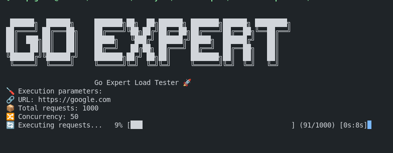
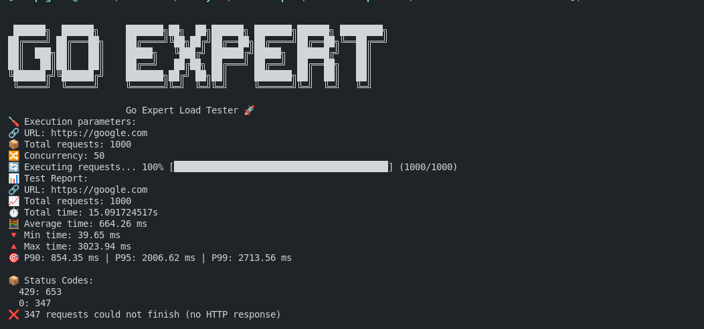

# Go CLI Load Tester (English version below)

## Descrição

Este projeto é uma **ferramenta CLI desenvolvida como parte de um exercício de pós-graduação em Golang**. O objetivo é criar uma ferramenta de **teste de carga** configurável que execute um número determinado de requisições HTTP a um serviço web, com controle de **concorrência** e **relatório detalhado de desempenho**.

A ferramenta permite ao usuário definir a **URL do serviço**, o número total de **requisições** e a **quantidade de chamadas simultâneas**, gerando ao final um relatório com estatísticas como tempo médio de resposta, percentis (P90, P95, P99) e códigos de status HTTP retornados.




### Requisitos do projeto

- A aplicação deve aceitar os seguintes parâmetros via linha de comando:
  - `--url`: URL do serviço a ser testado
  - `--requests`: número total de requisições
  - `--concurrency`: número de requisições simultâneas
- Deve executar todas as requisições com controle de concorrência
- Ao final da execução, exibir um **relatório completo**, contendo:
  - Tempo total gasto
  - Tempo médio, mínimo e máximo de resposta
  - Percentis: P90, P95, P99
  - Distribuição dos códigos de status HTTP
- Saída formatada e colorida no terminal
- Executável via linha de comando ou **Docker**

## Funcionalidades

- Interface CLI interativa com o pacote `cobra`
- Teste de carga com controle preciso de concorrência
- Barra de progresso para visualização em tempo real
- Relatório com métricas detalhadas de desempenho
- Códigos de status HTTP agrupados e destacados por cor
- ASCII banner e mensagens visuais
- Pronto para execução via Docker

## Requisitos

- Go 1.23 ou superior
- Docker (opcional, para execução isolada)

## Como Executar

### Usando Go diretamente:

´´´
go run main.go --url=https://google.com --requests=1000 --concurrency=50
´´´

### Usando Docker:

´´´
docker build -t loadtester .
docker run loadtester --url=https://google.com --requests=1000 --concurrency=50
´´´

## Exemplo de Saída

```
🔗 URL: https://google.com  
📦 Total requests: 1000  
🔀 Concurrency: 50  

📊 Test Report:  
⏱️  Total time: 2.345s  
🧮 Average time: 23.45 ms  
🔻 Min time: 10.12 ms  
🔺 Max time: 120.98 ms  
🎯 P90: 35.23 ms | P95: 45.11 ms | P99: 88.20 ms  

📦 Status Codes:  
✅ All requests were successful (2xx)
```




---

# Go CLI Load Tester (Versão em Português acima)


## Description

This project is a **CLI tool developed as part of a postgraduate exercise in Golang**. The goal is to build a configurable **load testing tool** capable of performing HTTP requests against a web service, controlling **concurrency**, and outputting a **detailed performance report**.

The user can define the **target service URL**, the total number of **requests**, and the **concurrency level**. After execution, the tool provides metrics such as average response time, percentiles (P90, P95, P99), and the distribution of HTTP status codes.


### Project Requirements

- The CLI must accept the following parameters:
  - `--url`: URL of the service to test
  - `--requests`: total number of requests
  - `--concurrency`: number of simultaneous requests
- Requests must be dispatched respecting the concurrency level
- After execution, a detailed report must be printed showing:
  - Total execution time
  - Average, min, and max response time
  - Percentiles: P90, P95, P99
  - HTTP status code distribution
- Output should be formatted and colorized
- Can be run from command line or via **Docker**

## Features

- Interactive CLI built with `cobra`
- Load testing with controlled concurrency
- Live progress bar for tracking request status
- Final performance report with detailed metrics
- Colored HTTP status code summary
- ASCII banner for visual branding
- Docker-ready

## Requirements

- Go 1.23 or newer
- Docker (optional)

## How to Run

### Using Go:


´´´
go run main.go --url=https://google.com --requests=1000 --concurrency=50
´´´

### Using Docker:

´´´
docker build -t loadtester .
docker run loadtester --url=https://google.com --requests=1000 --concurrency=50
´´´

## Example Output

```
🔗 URL: http://localhost:8080  
📦 Total requests: 1000  
🔀 Concurrency: 50  

📊 Test Report:  
⏱️  Total time: 2.345s  
🧮 Average time: 23.45 ms  
🔻 Min time: 10.12 ms  
🔺 Max time: 120.98 ms  
🎯 P90: 35.23 ms | P95: 45.11 ms | P99: 88.20 ms  

📦 Status Codes:  
✅ All requests were successful (2xx)

```


---
